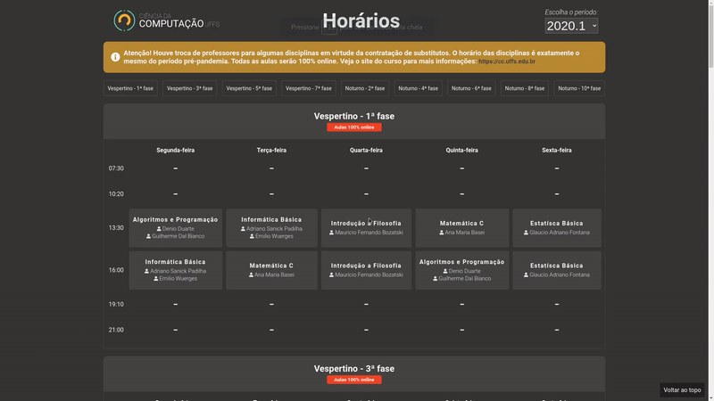

<p align="center">
  
</p>

<p align="center">
  
</p>

## Sobre o Projeto

Esse repositório contém a aplicação para mostrar e organizar as salas de aula do curso de Ciência da Computação da UFFS, Chapecó/SC. A página está disponível em [cc.uffs.edu.br/horario](https://cc.uffs.edu.br/horario/). 

### Estrutura do dados

#### Professores

As informações sobre cada professor estão no arquivo chamado `./data/members.json`. A estrutura do arquivo é a seguinte:

```js 
{
    "fernando.bevilacqua": {
        "name": "Fernando Bevilacqua",
        "email": "fernando.bevilacqua@uffs.edu.br"
    },
    "lcaimi": {
        "name": "Luciano Lores Caimi",
        "email": "fernando.bevilacqua@uffs.edu.br"
    },
    ...
}
```

#### Fases do Curso

As informações sobre cada fase do curso estão no arquivo chamado `./data/groups.json`. A estrutura do arquivo é a seguinte:

```js 
{
    {
        "id": 1,
        "name": "Vespertino - 1ª fase"
    },
    {
        "id": 2,
        "name": "Vespertino - 3ª fase"
    },
    ...
}
```

#### Disciplinas

As informações sobre cada disciplina estão no arquivo chamado `./data/courses.json`. A estrutura do arquivo é a seguinte:

```js 
{
    "gex178": {
        "name": "Nome da disciplina",
        "description": "Descrição resumida da disciplina"
    },
    "gex179": {
        "name": "Nome da outra disciplina",
        "description": "Descrição resumida da outra disciplina"
    },
    ...
}
```

#### Organização da tabela

Como as informações da tabela são organizadas estão no arquivo chamado `./data/$NOME_SEMESTRE/schedule.json`. A estrutura do arquivo é a seguinte:

```js 
[
    {
        "id": 1, // ID 
        "code": "GEX208", // ID da disciplina
        "group": 1, // ID da fase do curso
        "weekDay": 2, // Identificador do dia da semana(Segunda, Terça, Quarta...)
        "period": 5, // Identificador do período(07:30, 10:20, 13:30 ...)
        "members": [...] // Array de ID's do professores
    },
]
```

## Features

* Conceitos de flexbox;
* Uso do tema de cores do curso;
* Script para gerar as tabelas;
* Tooltips criados com CSS.


## Licença

Esse projeto é licenciado nos termos da licença open-source [Apache 2.0](https://choosealicense.com/licenses/apache-2.0/) e está disponível de graça.